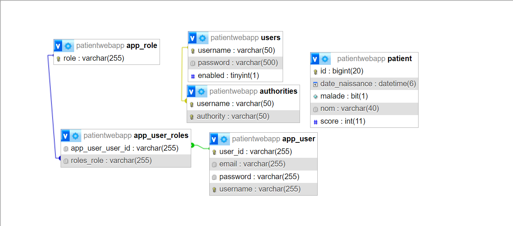
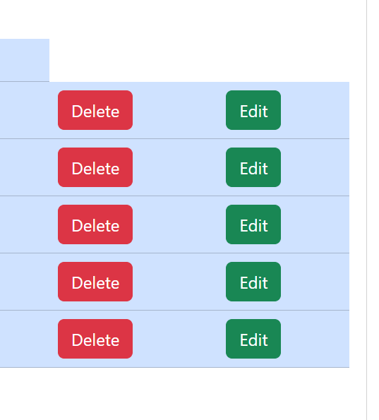

<h1>Rapport: Projet Spring Boot avec Spring Security</h1>
<h2>Development Web JEE Spring MVC</h2>
<h2>Introduction</h2>

Ce rapport décrit en détail le processus de développement d'une application web sécurisée axée sur la gestion des patients, en utilisant les frameworks Spring Boot et Spring Security. Les étapes clés de ce développement comprennent la création d'un projet avec les dépendances nécessaires, l'implémentation des entités JPA pour les patients, la configuration de la persistance des données, la mise en place d'un contrôleur Spring MVC, et la création de vues Thymeleaf.
Une caractéristique importante de ce projet est sa flexibilité en termes de connexion à la base de données, on utilisant MySQL. Pour renforcer la sécurité de l'application, Spring Security est intégré, en mettant en œuvre trois stratégies d'authentification : InMemoryAuthentication, JdbcAuthentication, et UserDetailsService.
L'objectif final de ce projet est de fournir une application web opérationnelle, adaptable et sécurisée, en tirant parti de manière judicieuse des fonctionnalités offertes par Spring Boot et Spring Security. L'inclusion de différentes stratégies d'authentification vise à garantir un niveau élevé de sécurité, tandis que la flexibilité de la base de données permet une adaptabilité maximale aux différentes configurations et exigences.

<h2>Ennoncé</h2>

Concevoir une application Web JEE en utilisant Spring MVC, Thymeleaf et Spring Data JPA pour la gestion des patients nécessite la mise en œuvre des fonctionnalités suivantes :

<ul>
<li>Stocker les patiens dans H2 DataBase puis dans MySQL</li>
<li>Afficher les patients</li>
<li>Chercher les patients</li>
<li>Ajouter un patient</li>
<li>Modifier un patient</li>
<li>Supprimer un patient</li>

</ul>
<ul>
<h2>Conception</h2>

<h2>Réalisation</h2>

<h4><li>navbare quie se change pas</li></h4>

<h4><li>Affichage des patients avec la pagination</li></h4>

<h4><li>Chercher les patients</li></h4>

<h4><li>Ajouter un patient</li></h4>

<h4><li>Les action delete et edit</li></h4>

</ul>
<h3>
<li>Sécuriser  avec integration de système d'authentification basé sur Spring security: 
</li>
</h3>
<ul>
<li>
@Configuration : Indique que la classe est une configuration Spring, permettant la définition de beans et de configurations.
</li>
<li>
@EnableWebSecurity : Active la configuration de sécurité web de Spring Security.
</li>
<li>
@EnableMethodSecurity(prePostEnabled = true) : Active la sécurité basée sur les annotations pour les méthodes. prePostEnabled = true permet l'utilisation des annotations @PreAuthorize et @PostAuthorize pour définir des règles de sécurité au niveau des méthodes.
</li>
<li>
@AllArgsConstructor : Lombok génère automatiquement un constructeur qui prend tous les champs de la classe comme paramètres. Cela est utile pour l'injection de dépendances.
</li>
</ul>
<h5>Attributs utilisés :</h5>
<ul>
<li>
private PasswordEncoder passwordEncoder; : Un bean qui encode les mots de passe. Utilisé pour sécuriser les mots de passe stockés dans la base de données.
</li>
<li>
private UserDetailServiceImpl userDetailServiceImpl; : Un service personnalisé qui implémente l'interface UserDetailsService. Ce service est utilisé pour récupérer les détails de l'utilisateur, notamment lors de l'authentification.
</li>
</ul>
 

<h4><li>InMemoryAuthentication dans SecurityConfig</li></h4>
<ul>
<li>
Définition : Cette stratégie d'authentification stocke les informations d'identification des utilisateurs en mémoire, généralement dans la configuration du code.
</li>
<li>
Différence : Les détails des utilisateurs sont définis directement dans le code, et ils restent en mémoire pendant la durée de vie de l'application. Cette approche est souvent utilisée pour des utilisateurs statiques et dans des environnements de développement.
</li>

</ul>

<h4><li>JdbcAuthentication dans SecurityConfig</li></h4>
<ul>
<li>
Définition : Cette stratégie d'authentification utilise une base de données relationnelle (comme MySQL, PostgreSQL, etc.) pour stocker et récupérer les informations d'identification des utilisateurs.
</li>
<li>

Différence : Les détails des utilisateurs sont stockés dans une base de données externe. Cela offre une solution plus évolutive pour la gestion des utilisateurs, particulièrement dans des environnements de production.
</li>

<h4><li>UserDetailsService dans SecurityConfig</li></h4>
<ul>
<li>
Définition : Cette interface permet de récupérer les détails de l'utilisateur à partir de n'importe quelle source de données personnalisée, par exemple, une base de données NoSQL, un service web, etc.
</li>

<li>
Différence : Plutôt que de déclarer une stratégie d'authentification spécifique, cette approche permet de connecter un service personnalisé (UserDetailServiceImpl dans ce cas) qui implémente l'interface UserDetailsService. Cela offre une grande flexibilité pour récupérer les détails des utilisateurs à partir de diverses sources.
</li>

<h4><li>Sécuriser les données des utilisateurs</li></h4>

 La sécurité des données des utilisateurs est une priorité fondamentale de l'application. En utilisant passwordEncoder.encode(), les mots de passe des utilisateurs sont cryptés avant d'être stockés dans la base de données. Cette étape est cruciale pour assurer la confidentialité des informations sensibles et empêcher les accès non autorisés.

<ul>

<h4><li>Gérer les droits d'accès</li></h4>

Cette section essentielle de notre application se concentre sur la gestion minutieuse des droits d'accès, jouant un rôle fondamental dans la sécurité globale. Grâce à l'usage avisé de Spring Security, notre configuration permet une gestion précise des autorisations, notamment en définissant des règles spécifiques pour l'accès à des ressources telles que les Webjars et la console H2. La classe SecurityConfig offre une souplesse notable en permettant la définition de règles basées sur les rôles des utilisateurs, facilitée par les méthodes hasRole("USER") et hasRole("ADMIN").

<ul>
<strong>
<li>
Personnalisation du Processus de Connexion avec "httpSecurity.formLogin().loginPage("/login").defaultSuccessUrl("/").permitAll();" </li>
</strong>
 
<strong>httpSecurity.formLogin() :</strong> Active la gestion du processus de connexion fourni par Spring Security.
<strong> .loginPage("/login") : </strong>  Spécifie la page de connexion personnalisée. Plutôt que d'utiliser la page de connexion par défaut fournie par Spring Security, l'application redirigera les utilisateurs vers la page spécifiée ("/login") lorsqu'une authentification est requise.
<strong> .defaultSuccessUrl("/") :</strong>  Définit l'URL par défaut vers laquelle un utilisateur est redirigé après une connexion réussie. Dans ce cas, l'utilisateur est redirigé vers la page principale ("/").
<strong> .permitAll() : </strong> Autorise l'accès à la page de connexion spécifiée par n'importe quel utilisateur, même s'il n'est pas authentifié. Cela garantit que la page de connexion est accessible à tous, même à ceux qui ne sont pas encore connectés.
<h2>Conclusion</h2>

Cette application Spring Boot, dotée de Spring Security, propose une gestion robuste des patients avec une attention particulière portée à la sécurité. En intégrant des fonctionnalités flexibles telles que la pagination et la recherche, et en personnalisant l'authentification à l'aide de méthodes telles qu'InMemoryAuthentication, JdbcAuthentication et UserDetailsService, l'application combine efficacité, adaptabilité et sécurité de manière harmonieuse.

</ul>
</ul>
</ul>
#